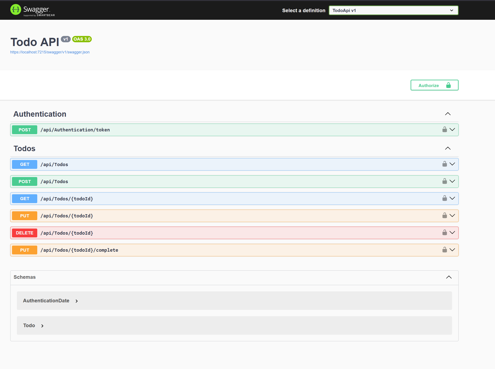

# Genesis
The code is based on "Web API From Start to Finish" course

[About course](https://www.iamtimcorey.com/courses/webapi-from-start-to-finish/)

# Technologi used
- .NET 6
- Postgresql
- ASP.NET
- Minimal API
- Open API
- REST
- Cashing
- Tokens and Claims

# Example

## Todo App

This is a simple app that manages a to-do list for users.

### Swagger

